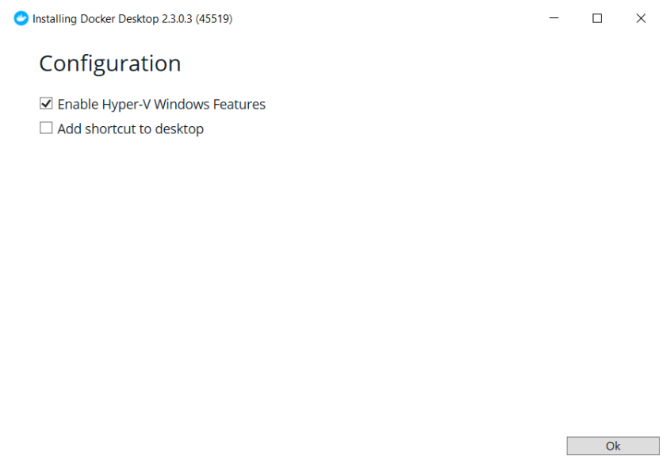
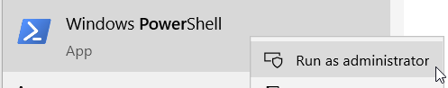
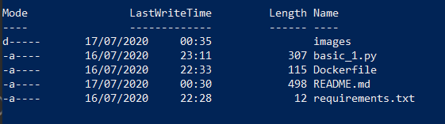
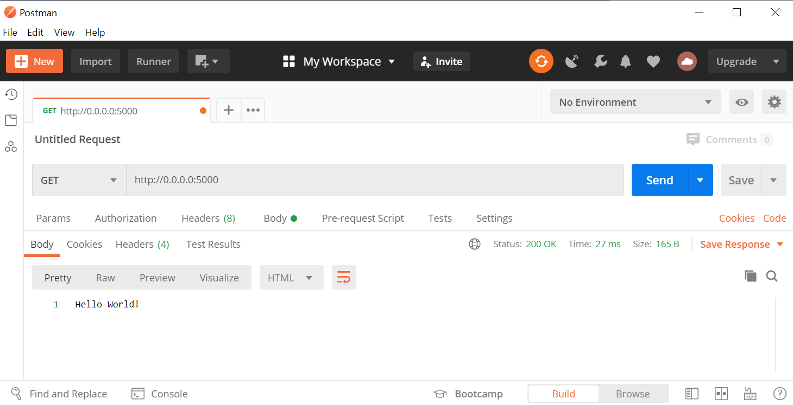
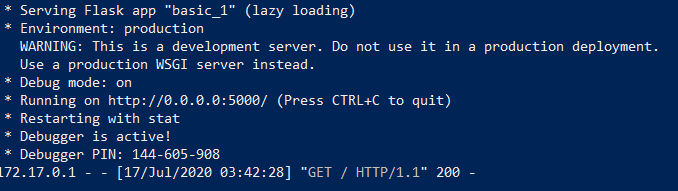

# Docker

Docker training <3

## Docker installation
Go to [docker site](https://docs.docker.com/get-docker/) and donwload for your S.O.

Caution:

### Windows
* works for: Pro, Enterprise, Education
* for 'Home' use this [link](https://docs.docker.com/docker-for-windows/install-windows-home/)
* Hyper-V and windows containers must be enable



## Powershell for docker
Open `powershell` within admin mode.



Go to file location on powershell


If you are in the right file location, then when run ```dir``` this is what you'll something like this:



### Build and run docker
```
docker build . -t <image_name>
docker run -p port:port --name <container_name> <image_name>
```

Call on postman (from docker_1):



Response on powershell (from docker_1):




### Stop and remove image or container
To see image list run:
```
docker image list
```

To remove a image:
```
docker image rm image_name
```


To see container list:
```
docker container list
```

To remove a container, first you'll need to stop it:
```
docker container stop <container_name>
docker container rm <container_name>
```
