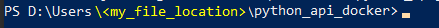
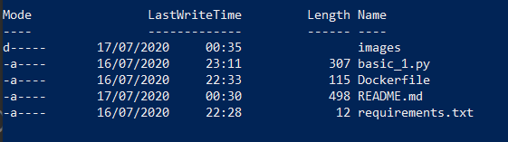
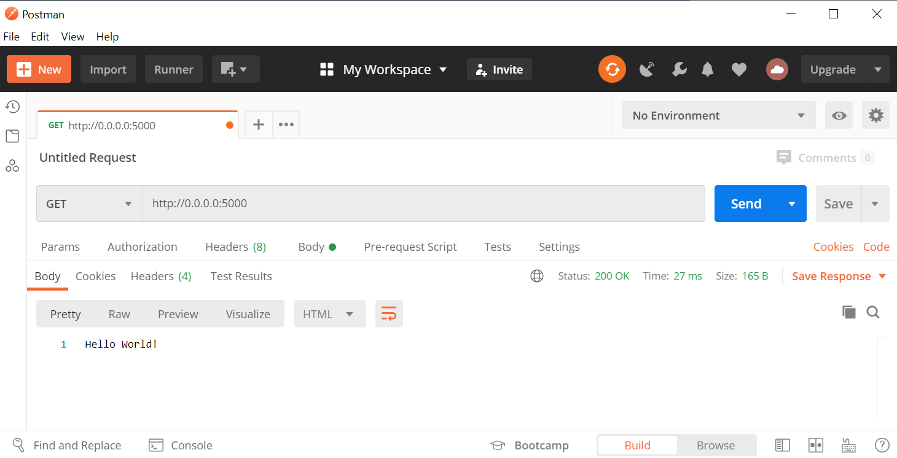
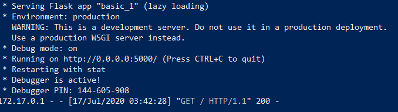

# Docker sample 1

* My first docker <3

## Powershell for docker
Open `powershell` within admin mode.


Go to file location on powershell



If you are in the right file location, then when run ```dir``` this is what you'll see.



### Build and run docker
```
docker build . -t basic1
docker run -p 5000:5000 --name test basic1
```

Call on postman:



Response on powershell:




### Stop and remove container
To see image list run:
```
docker image list
```

To remove this image:
```
docker image rm basic1
```


To see container list:
```
docker container list
```

To remove this container, first you'll need to stop it:
```
docker container stop test
docker container rm test
```