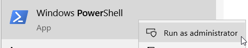
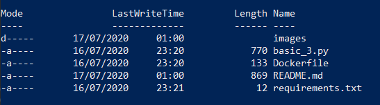
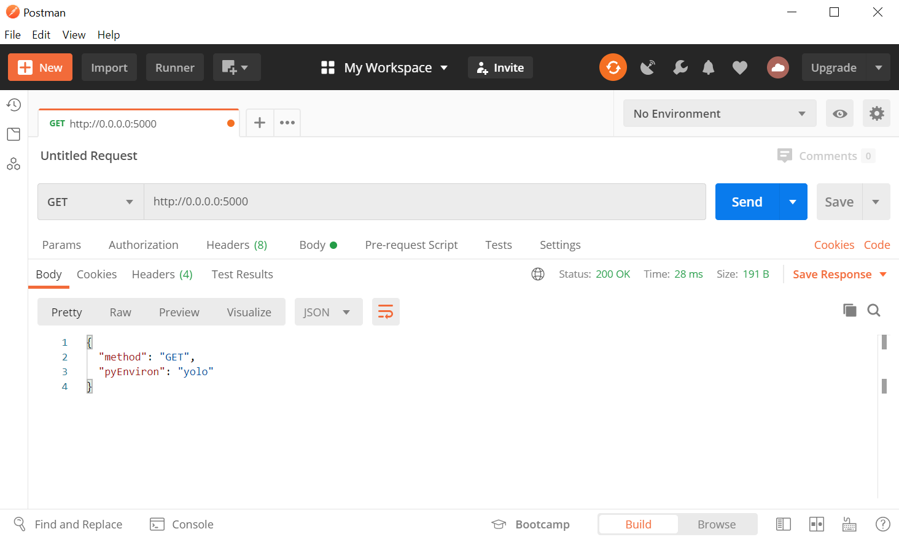
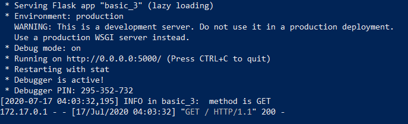

# Docker sample 3

* My third docker <3

## Powershell for docker
Open `powershell` within admin mode.



Go to file location on powershell


If you are in the right file location, then when run ```dir``` this is what you'll see.



### Build and run docker
```
docker build . -t basic3
docker run -p 5000:5000 --name test basic3
```

Call on postman:



Response on powershell:




### Stop and remove container
To see image list run:
```
docker image list
```

To remove this image:
```
docker image rm basic2
```


To see container list:
```
docker container list
```

To remove a container, first you'll need to stop it:
```
docker container stop test
docker container rm test
```