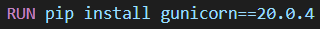
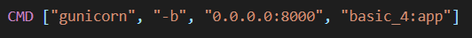
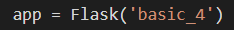
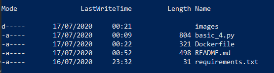
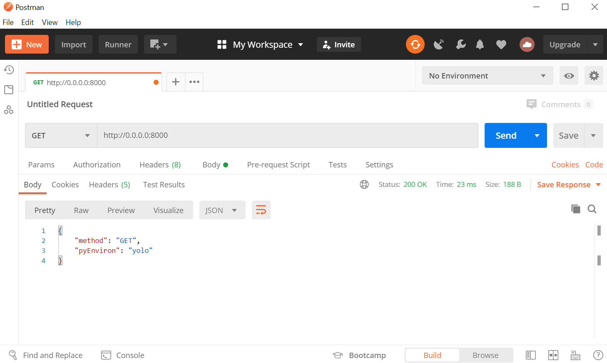
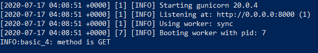

# Docker sample 4 - docker with gunicorn

* My fourth docker <3
* My first docker with Flask and Gunicorn <3

## Using gunicorn
1. Gunicorn must be installed from `dockerfile`



2. The command for gunicorn must has `host:port` information

Option 1: CMD ["gunicorn", "-b",  \<host\>:\<port\>,, \<pyFile\>:\<app\>]

Option 2: CMD ["gunicorn", "--bind",  \<host\>:\<port\>,, \<pyFile\>:\<app\>]

We used this command:


Because the `basic_4` is the python file and the `app` is the Flask main class instanced.



## Powershell for docker
Open `powershell` within admin mode.


Go to file location on powershell


If you are in the right file location, then when run ```dir``` this is what you'll see.



### Build and run docker
```
docker build . -t basic4
docker run -p 8000:8000 --name test basic4
```

Call on postman:



Response on powershell:




### Stop and remove container
To see image list run:
```
docker image list
```

To remove this image:
```
docker image rm basic2
```


To see container list:
```
docker container list
```

To remove a container, first you'll need to stop it:
```
docker container stop test
docker container rm test
```