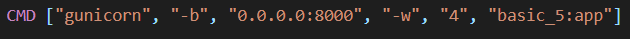
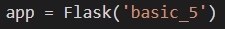
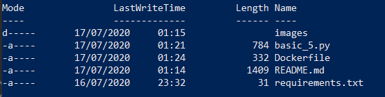
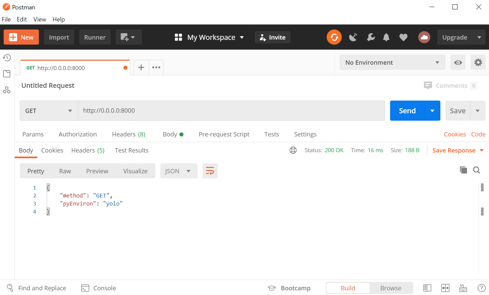
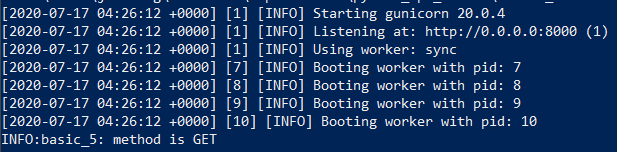

# Docker sample 4 - docker with gunicorn

My third docker <3

## Gunicorn with Workers
### Running on docker
1. Gunicorn must be installed from `dockerfile`


2. The command for gunicorn must has `host:port` information
3. For the workers, you can choose:

Option 1: CMD ["gunicorn", "-b", \<host\>:\<port\>, "-w", "<workers_numer>", \<pyFile\>:\<app\>]

Option 2: CMD ["gunicorn", "--bind", \<host\>:\<port\>,, "--workers", "<workers_numer>", \<pyFile\>:\<app\>]

We used this command:


Because the `basic_5` is the python file and the `app` is the Flask main class instanced.



### wokers advantage

Gunicorn has 2 workers type:
* `sync worker`
* `async worker`


### `sync worker`
[reference](https://docs.gunicorn.org/en/stable/design.html)

* Default worker type
* Most basic
* Handles a single request at a time
* Does not support persistent connections

To use persistent connections, add `keep-alive` or `Connection: keep-alive`.

add on CMD on docker "--keep-alive", INT
```docker
CMD ["gunicorn", "--bind", \<host\>:\<port\>,, "--workers", "<workers_numer>", "--keep-alive", \<INT\>, \<pyFile\>:\<app\>]
```
### `async worker`

* available based on Greenlets¹
* full Greenlets¹ support app might need help

¹ implementation of cooperative multi-threading for Python: [github](https://github.com/python-greenlet/greenlet)

### other configs for gunicorn
[reference](https://docs.gunicorn.org/en/stable/settings.html)

See [performance_test](../performance_test.md) for how discover for app.
#### Timeout:
Workers shut out usualy after 30sec. To change this, add:

* "-t", \<INT\>
* "--timeout", \<INT\>

```docker
CMD ["gunicorn", "--bind", \<host\>:\<port\>,, "--workers", "<workers_numer>", "-t", \<INT\>, \<pyFile\>:\<app\>]
```

#### Max Request:
Max requests number a worker will process before restarting. The default is `0` then the automatic worker restarts are disabled.

This method helps limit the damage of memory leaks.

* "--max-requests", \<INT\>

```docker
CMD ["gunicorn", "--bind", \<host\>:\<port\>,, "--workers", "<workers_numer>", "--max-requests", \<INT\>, \<pyFile\>:\<app\>]
```

#### Threads:
Set the number of threads for handling requests on each worker. Usually this number is related to app's work load.

Default value is `1`.

* "--threads", \<INT\>

```docker
CMD ["gunicorn", "--bind", \<host\>:\<port\>,, "--workers", "<workers_numer>", "--threads", \<INT\>, \<pyFile\>:\<app\>]
```

## Powershell for docker
Open `powershell` within admin mode.


Go to file location on powershell


If you are in the right file location, then when run ```dir``` this is what you'll see.



### Build and run docker
```
docker build . -t basic4
docker run -p 8000:8000 --name test basic4
```

Call on postman:



Response on powershell:




### Stop and remove container
To see image list run:
```
docker image list
```

To remove this image:
```
docker image rm basic2
```


To see container list:
```
docker container list
```

To remove a container, first you'll need to stop it:
```
docker container stop test
docker container rm test
```