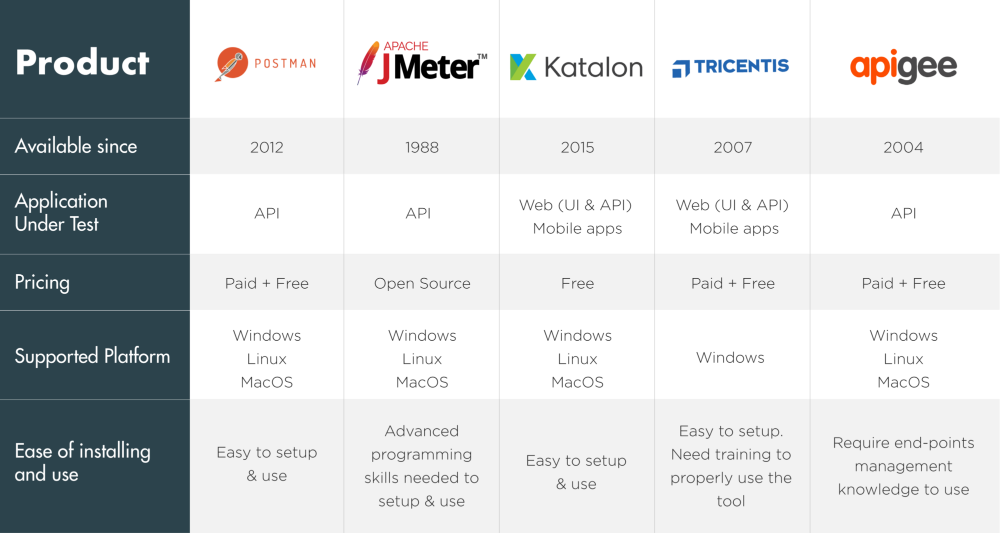

# Performance test (teste de carga)

Suggestions for performance test:
* [Postman](https://www.postman.com/)
* [Apache Jmeter](https://jmeter.apache.org/)
* [Katalon Studio](https://ghostinspector.com/landing/web-application-testing/?gclid=EAIaIQobChMI4tzd4cTT6gIVCxKRCh1aOAkDEAAYASAAEgLEfPD_BwE)
* [Tricentis](https://www.tricentis.com/products/)
* [apigee](https://apigee.com/api-management/)

Products comparison [here](https://www.infoq.com/br/articles/10-ferramentas-teste-api/).

## Why do a performance test?

>_“Performance testing is artificially creating or simulating load and measuring how your environment handles it.”_

Even if your want to make available, fast, secure and reliable, the code can have limitations, like:

* extenal calling
* time for code processing
* multi-threading limitations

Some performance tests types and its goals:

* **Baseline Testing** -> identify metrics for system performance under normal load
* **Load Testing** -> Find metrics for system performance under high load.
* **Stress Testing** -> Find system breaking point
* **Soak Testing** -> Make sure no unwanted behavior emerges over a long period of time
* **Scalability Testing** -> Find metrics and check if the system performance changes appropriately to the load

[references](https://www.soapui.org/docs/load-testing/concept/)